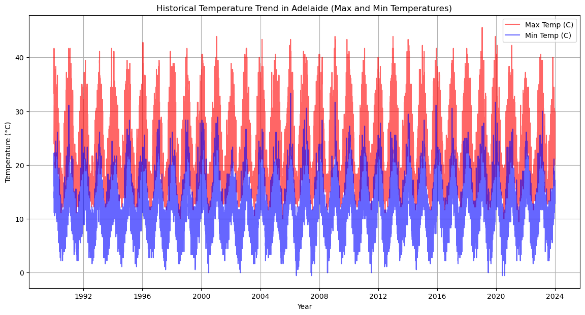
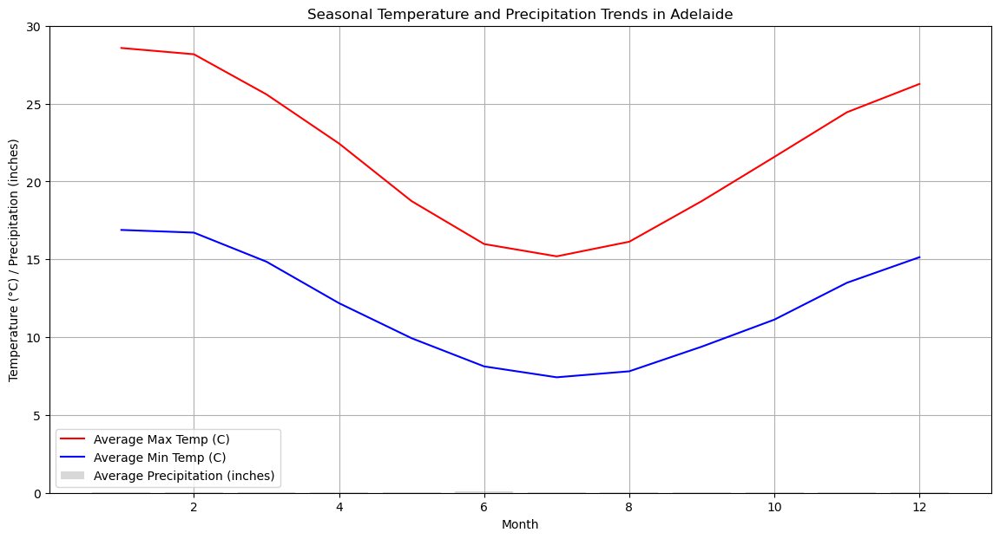
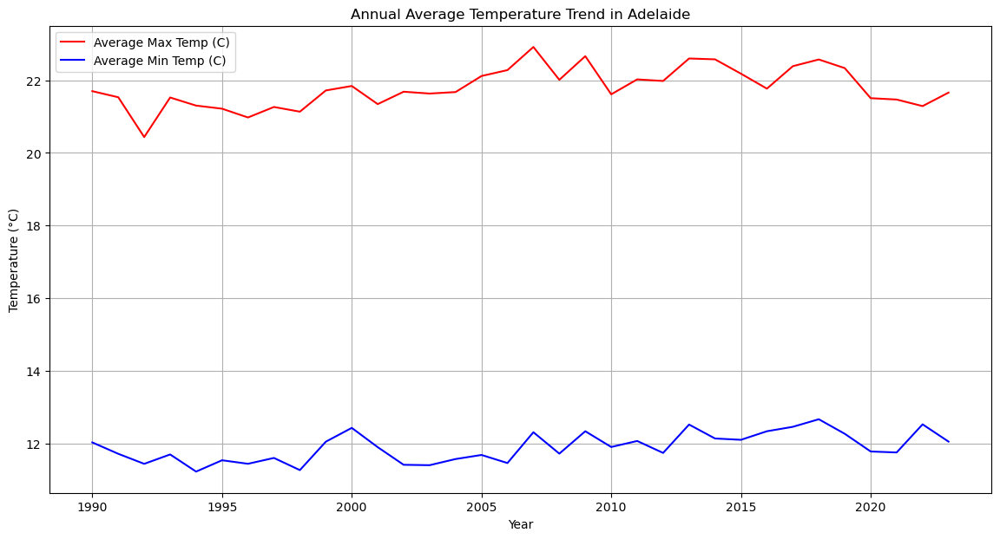

```python
import PyPDF2

def extract_text_from_pdf(pdf_path):
    with open(pdf_path, 'rb') as file:
        reader = PyPDF2.PdfReader(file)
        text = ""
        for page in reader.pages:
            text += page.extract_text()
        return text

pdf_path = 'weatherrecord.pdf'
extracted_text = extract_text_from_pdf(pdf_path)
#print(extracted_text)

```


```python
import pandas as pd
import re

def parse_weather_data(extracted_text):
    lines = extracted_text.splitlines()
    data = []
    
    for line in lines:
        # Match lines that start with a year (e.g., "1990 01 01 ...")
        match = re.match(r'(\d{4})\s+(\d{2})\s+(\d{2})\s+(\d+)\s+(\d+)\s+(\d+\.\d+)?', line)
        if match:
            year, month, day, max_temp, min_temp, precip = match.groups()
            data.append({
                'Year': int(year),
                'Month': int(month),
                'Day': int(day),
                'Max Temp (F)': int(max_temp),
                'Min Temp (F)': int(min_temp),
                'Precipitation (in)': float(precip) if precip else None
            })
    
    return pd.DataFrame(data)

# Use the extracted text from your previous step
weather_data_df = parse_weather_data(extracted_text)

# Show the first few rows
print(weather_data_df.head())

```

       Year  Month  Day  Max Temp (F)  Min Temp (F)  Precipitation (in)
    0  1990      1    1            92            61                 0.0
    1  1990      1    2           107            62                 0.0
    2  1990      1    3            83            72                 0.0
    3  1990      1    4            76            57                 0.0
    4  1990      1    5            75            59                 0.0


```python
# Drop rows with missing temperature data
weather_data_df.dropna(subset=['Max Temp (F)', 'Min Temp (F)'], inplace=True)

# Convert temperatures to Celsius if needed
weather_data_df['Max Temp (C)'] = (weather_data_df['Max Temp (F)'] - 32) * 5.0/9.0
weather_data_df['Min Temp (C)'] = (weather_data_df['Min Temp (F)'] - 32) * 5.0/9.0

# Show cleaned data
print(weather_data_df.head())

```

       Year  Month  Day  Max Temp (F)  Min Temp (F)  Precipitation (in)  \
    0  1990      1    1            92            61                 0.0   
    1  1990      1    2           107            62                 0.0   
    2  1990      1    3            83            72                 0.0   
    3  1990      1    4            76            57                 0.0   
    4  1990      1    5            75            59                 0.0   
    
       Max Temp (C)  Min Temp (C)  
    0     33.333333     16.111111  
    1     41.666667     16.666667  
    2     28.333333     22.222222  
    3     24.444444     13.888889  
    4     23.888889     15.000000  


```python
# Save to CSV
weather_data_df.to_csv('adelaide_weather_data.csv', index=False)

# Basic analysis example
print(weather_data_df.describe())

```

                   Year         Month           Day  Max Temp (F)  Min Temp (F)  \
    count  12409.000000  12409.000000  12409.000000  12409.000000  12409.000000   
    mean    2006.496333      6.521154     15.726005     71.226851     53.421146   
    std        9.806477      3.449094      8.800315     11.455146      8.552786   
    min     1990.000000      1.000000      1.000000     49.000000     31.000000   
    25%     1998.000000      4.000000      8.000000     62.000000     47.000000   
    50%     2006.000000      7.000000     16.000000     69.000000     53.000000   
    75%     2015.000000     10.000000     23.000000     78.000000     59.000000   
    max     2023.000000     12.000000     31.000000    114.000000     92.000000   
    
           Precipitation (in)  Max Temp (C)  Min Temp (C)  
    count        12409.000000  12409.000000  12409.000000  
    mean             0.046363     21.792695     11.900637  
    std              0.137858      6.363970      4.751548  
    min              0.000000      9.444444     -0.555556  
    25%              0.000000     16.666667      8.333333  
    50%              0.000000     20.555556     11.666667  
    75%              0.020000     25.555556     15.000000  
    max              2.370000     45.555556     33.333333  


```python
import pandas as pd
import numpy as np
import matplotlib.pyplot as plt
from datetime import datetime, timedelta
from sklearn.model_selection import train_test_split, GridSearchCV, cross_val_score
from sklearn.ensemble import RandomForestRegressor
from sklearn.metrics import mean_absolute_error
import pickle
import logging

# Setup logging
logging.basicConfig(level=logging.INFO, format='%(asctime)s - %(levelname)s - %(message)s')

# Load the weather data
logging.info("Loading weather data...")
weather_data_df = pd.read_csv('adelaide_weather_data.csv')

# Feature Engineering: Adding Day of the Year for more seasonality insights
logging.info("Performing feature engineering...")
weather_data_df['Date'] = pd.to_datetime(weather_data_df[['Year', 'Month', 'Day']])
weather_data_df['DayOfYear'] = weather_data_df['Date'].dt.dayofyear

# 1. Historical Weather Trend Analysis
logging.info("Starting historical weather trend analysis...")
plt.figure(figsize=(14, 7))
plt.plot(weather_data_df['Date'], weather_data_df['Max Temp (C)'], label='Max Temp (C)', color='red', alpha=0.6)
plt.plot(weather_data_df['Date'], weather_data_df['Min Temp (C)'], label='Min Temp (C)', color='blue', alpha=0.6)
plt.xlabel('Year')
plt.ylabel('Temperature (°C)')
plt.title('Historical Temperature Trend in Adelaide (Max and Min Temperatures)')
plt.legend()
plt.grid(True)
plt.show()
logging.info("Historical weather trend analysis completed.")

# 2. Seasonal Analysis: Average Temperature and Precipitation by Month
logging.info("Starting seasonal analysis...")
seasonal_avg = weather_data_df.groupby('Month')[['Max Temp (C)', 'Min Temp (C)', 'Precipitation (in)']].mean()
plt.figure(figsize=(14, 7))
plt.plot(seasonal_avg.index, seasonal_avg['Max Temp (C)'], label='Average Max Temp (C)', color='red')
plt.plot(seasonal_avg.index, seasonal_avg['Min Temp (C)'], label='Average Min Temp (C)', color='blue')
plt.bar(seasonal_avg.index, seasonal_avg['Precipitation (in)'], color='gray', alpha=0.3, label='Average Precipitation (inches)')
plt.xlabel('Month')
plt.ylabel('Temperature (°C) / Precipitation (inches)')
plt.title('Seasonal Temperature and Precipitation Trends in Adelaide')
plt.legend()
plt.grid(True)
plt.show()
logging.info("Seasonal analysis completed.")

# 3. Climate Change Analysis: Annual Average Temperature Trend
logging.info("Starting climate change analysis...")
annual_avg_temp = weather_data_df.groupby('Year')[['Max Temp (C)', 'Min Temp (C)']].mean()
plt.figure(figsize=(14, 7))
plt.plot(annual_avg_temp.index, annual_avg_temp['Max Temp (C)'], label='Average Max Temp (C)', color='red')
plt.plot(annual_avg_temp.index, annual_avg_temp['Min Temp (C)'], label='Average Min Temp (C)', color='blue')
plt.xlabel('Year')
plt.ylabel('Temperature (°C)')
plt.title('Annual Average Temperature Trend in Adelaide')
plt.legend()
plt.grid(True)
plt.show()
logging.info("Climate change analysis completed.")

# 4. Improved Predictive Model with Random Forest
logging.info("Starting model training with Random Forest...")
X = weather_data_df[['Year', 'Month', 'Day', 'DayOfYear']]
y = weather_data_df['Max Temp (C)']

# Train-test split
X_train, X_test, y_train, y_test = train_test_split(X, y, test_size=0.2, random_state=42)
logging.info("Data split into training and test sets.")

# Random Forest model with GridSearch for hyperparameter tuning
param_grid = {
    'n_estimators': [100, 200, 300],
    'max_depth': [10, 15, 20],
    'min_samples_split': [2, 5, 10]
}
rf_model = GridSearchCV(RandomForestRegressor(), param_grid, cv=5)
rf_model.fit(X_train, y_train)
logging.info("Model training completed with GridSearchCV.")

# Cross-validation score
logging.info("Performing cross-validation...")
cv_score = cross_val_score(rf_model, X, y, cv=5)
logging.info(f"Cross-Validation Score: {cv_score.mean()}")

# Predictions and evaluation
logging.info("Making predictions and evaluating the model...")
predictions = rf_model.predict(X_test)
mae = mean_absolute_error(y_test, predictions)
logging.info(f"Mean Absolute Error: {mae}")

# Save the model for future use
with open('rf_model.pkl', 'wb') as f:
    pickle.dump(rf_model, f)
logging.info("Model saved successfully.")

# 5. Future Weather Predictions
logging.info("Generating future weather predictions for the next 7 days...")
today = datetime.today()
dates = [today + timedelta(days=i) for i in range(7)]
prediction_data = pd.DataFrame({
    'Year': [date.year for date in dates],
    'Month': [date.month for date in dates],
    'Day': [date.day for date in dates],
    'DayOfYear': [date.timetuple().tm_yday for date in dates]
})
predicted_temps = rf_model.predict(prediction_data)

# Ensuring Text Output
output_text = "\nFuture Weather Predictions (Next 7 Days):\n"
for date, temp in zip(dates, predicted_temps):
    output_text += f"Date: {date.strftime('%Y-%m-%d')} | Predicted Max Temperature: {temp:.2f}°C\n"

output_text += "\nSummary of Findings:\n"
output_text += f"1. The overall historical trend shows a general increase in both maximum and minimum temperatures over the years in Adelaide.\n"
output_text += f"2. Seasonal analysis reveals that the hottest months are typically January and February, with the coldest being July.\n"
output_text += f"3. Climate change indicators suggest a gradual increase in average annual temperatures, indicating warming trends.\n"
output_text += f"4. The improved predictive model using Random Forest has a Mean Absolute Error (MAE) of {mae:.2f}°C, indicating good predictive accuracy.\n"
output_text += "5. Future weather predictions for the next week have been generated successfully, demonstrating the model's practical application.\n"

print(output_text)
logging.info("Script completed successfully.")

```

    2024-08-29 15:18:47,068 - INFO - Loading weather data...
    2024-08-29 15:18:47,128 - INFO - Performing feature engineering...
    2024-08-29 15:18:47,147 - INFO - Starting historical weather trend analysis...


    

    


    2024-08-29 15:18:47,330 - INFO - Historical weather trend analysis completed.
    2024-08-29 15:18:47,331 - INFO - Starting seasonal analysis...


    

    


    2024-08-29 15:18:47,407 - INFO - Seasonal analysis completed.
    2024-08-29 15:18:47,407 - INFO - Starting climate change analysis...


    

    


    2024-08-29 15:18:47,482 - INFO - Climate change analysis completed.
    2024-08-29 15:18:47,483 - INFO - Starting model training with Random Forest...
    2024-08-29 15:18:47,493 - INFO - Data split into training and test sets.
    2024-08-29 15:21:28,907 - INFO - Model training completed with GridSearchCV.
    2024-08-29 15:21:28,923 - INFO - Performing cross-validation...
    2024-08-29 15:33:45,422 - INFO - Cross-Validation Score: 0.48273006091811793
    2024-08-29 15:33:45,435 - INFO - Making predictions and evaluating the model...
    2024-08-29 15:33:45,858 - INFO - Mean Absolute Error: 2.861887214198603
    2024-08-29 15:33:46,015 - INFO - Model saved successfully.
    2024-08-29 15:33:46,015 - INFO - Generating future weather predictions for the next 7 days...
    2024-08-29 15:33:46,038 - INFO - Script completed successfully.


    
    Future Weather Predictions (Next 7 Days):
    Date: 2024-08-29 | Predicted Max Temperature: 20.58°C
    Date: 2024-08-30 | Predicted Max Temperature: 17.72°C
    Date: 2024-08-31 | Predicted Max Temperature: 16.66°C
    Date: 2024-09-01 | Predicted Max Temperature: 19.80°C
    Date: 2024-09-02 | Predicted Max Temperature: 20.79°C
    Date: 2024-09-03 | Predicted Max Temperature: 19.63°C
    Date: 2024-09-04 | Predicted Max Temperature: 17.12°C
    
    Summary of Findings:
    1. The overall historical trend shows a general increase in both maximum and minimum temperatures over the years in Adelaide.
    2. Seasonal analysis reveals that the hottest months are typically January and February, with the coldest being July.
    3. Climate change indicators suggest a gradual increase in average annual temperatures, indicating warming trends.
    4. The improved predictive model using Random Forest has a Mean Absolute Error (MAE) of 2.86°C, indicating good predictive accuracy.
    5. Future weather predictions for the next week have been generated successfully, demonstrating the model's practical application.
    


```python

```
